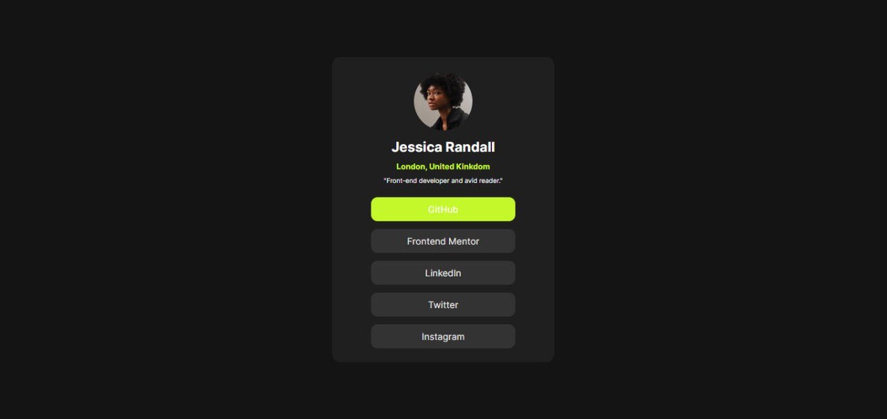
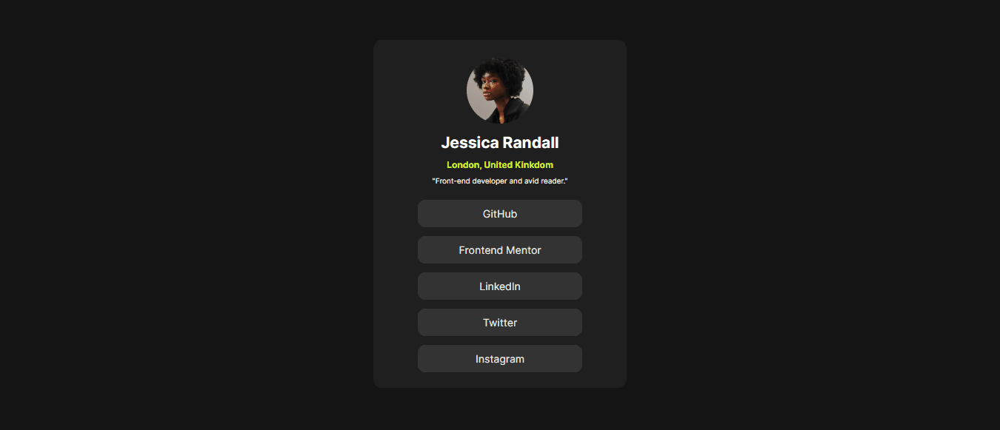

# Desafio de perfil de links sociais

Esta é uma solução para o [Desafio de perfil de links sociais no Frontend Mentor](https://www.frontendmentor.io/challenges/social-links-profile-UG32l9m6dQ). Os desafios do Frontend Mentor ajudam você a melhorar suas habilidades de codificação através da construção de projetos realistas. 

## Índice

- [Visão geral](#overview)
  - [O desafio](#O-desafio)
  - [Screenshot](#screenshot)
  - [Links](#links)
- [Meu processo](#my-process)
  - [Construído com](#built-with)
  - [O que eu aprendi](#what-i-learned)
  - [Desenvolvimento contínuo](#continued-development)
- [Autor](#author)
- [Agradecimentos](#acknowledgments)

## Visão geral

### O desafio

Os usuários devem ser capazes de:

- Ver os estados de foco de todos os elementos interativos na página

### Screenshot

![]

### Links

- URL da solução: (https://github.com/KaueACLima/projeto-perfil-de-links-sociais)
- URL do site ativo: (https://your-live-site-url.com)](https://kaueaclima.github.io/projeto-perfil-de-links-sociais/)

## Meu processo

### Construído com

- Marcação HTML5 semântica
- Propriedades personalizadas CSS

### O que eu aprendi

Aprendi depois de muitas aulas aprendi como usar uma media query para limitar o escopo do CSS, deixando resposivo para mobile. 

[]

Também aprendi como arrededondar uma imagem com CSS, sendo sicero cada vez que aprendo como utilizar os seletores 🤩 .

```html
<h1>Adicionando imagem e deixando redonda</h1>
```
```css
.img-redonda {
    width: 90px;
    height: 90px;
    margin: 23px 0px 10px;
    border-radius: 50%;
}
```
## Autor

- Frontend Mentor - [@KaueACLima](https://www.frontendmentor.io/profile/KaueACLima)
- Linkedin - [@Kaue Lima](https://www.linkedin.com/in/kau%C3%AA-lima-234515182/)

## Agradecimentos

Quero agradecer ao Frontend Mentor e ao Dev em dobro por me ajudar chegarem até aqui.

